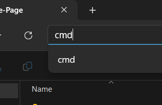
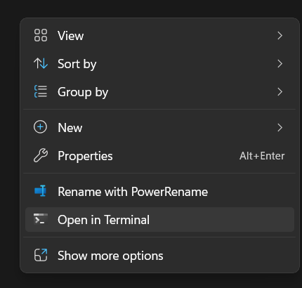

<!--
  TODO : () Add UI Design section with screenshots
-->

<div align="center" id="top">
    <br/>
  <h1>Albert Einstein</h1>
  <p>
    "
    "Life is like riding a bicycle. To keep your balance you must keep moving."

  </p>
  
</div>

## Table of Contents

- [:bulb: About](#bulb-about)
- [:computer: Tech Stack](#computer-tech-stack)
- [:rocket: Getting Started](#rocket-getting-started)

## :bulb: About

A modern tribute `landing page` for `Albert Einstein`, built with **React**, **TypeScript**, and **Tailwind CSS**. Showcases responsive design and a clean UI, while highlighting Einstein’s life and achievements.

## :computer: Tech Stack

- [React](https://reactjs.org/) (**Frontend Framework**)
- [TypeScript](https://www.typescriptlang.org/) (**Programming Language**)
- [Vite](https://vitejs.dev/) (**Build Tool**)
- [Tailwind CSS](https://tailwindcss.com/) (**CSS Framework**)
- [ESLint](https://eslint.org/) (**Linting Tool**)
- [Prettier](https://prettier.io/) (**Code Formatter**)

## :rocket: Getting Started

This project is a **UI-only** Landing Page built with **modern front-end** tooling.
No **backend** services or external **APIs** are required.

Follow these **steps** to set up and `run` the project locally.

### :clipboard: Prerequisites

Make sure you have the following installed on your machine before proceeding:

- **Node.js**
  - Atleast version `25.4.0`
  - Used for dependency management and running the development server.
  - **Download** from [Node.js official website](https://nodejs.org/).
- **npm** (comes with Node.js installation)
  - Used to install project dependencies.
- **Git**
  - Used for version control and cloning the repository.
  - **Download** from [Git official website](https://git-scm.com/).

### :mag: Verify Prerequisites

**Open** the terminal (**CMD**) and **run** the following commands to confirm the required tools are installed on your machine:

```bash
node -v
npm -v
git --version
```

### :inbox_tray: Installation Steps

1. **Clone the Repository**

   **Open** your **terminal** and run the following command to `clone` the repository:

   ```bash
   git clone https://github.com/pedromst2000/Einstein-Tribute-Page.git
   ```

2. **Navigate to the Project Directory**

After cloning the repository, navigate to the project directory using one of the following methods:

- **Method 1: Using the Address Bar**

  <figure align="center">
   
   <figcaption><b>Open</b> the repository folder and <b>write</b> <code>cmd</code> in the address bar to open the terminal directly in that folder.</figcaption>
  </figure>

- **Method 2: Using Right-Click Menu**

  <figure align="center">
   
   <figcaption><b>Open</b> the repository folder and <b>right-click</b> inside the folder, then select <b>"Open in Terminal"</b> or <b>"Open in PowerShell"</b> (depending on your system).</figcaption>
  </figure>

- **Method 3: Using Your IDE**

  **Open** your project folder using your preferred **IDE** (e.g., [Visual Studio Code](https://code.visualstudio.com/)) and open the integrated **terminal**.

3. **Install Dependencies**

   In the **terminal**, run the following command to **`install`** the project dependencies:

   ```bash
   npm install
   ```

   This command reads the `package.json` file and installs all the required packages listed under `dependencies` and `devDependencies`.

### :arrow_forward: **Start the Development Server**

After the dependencies are installed, start the development server by running the following command in the terminal:

```bash
npm run dev
```

This command will start the **Vite** development server and provide you with a local URL (usually `http://localhost:5173`) where you can view the project in your web browser.
