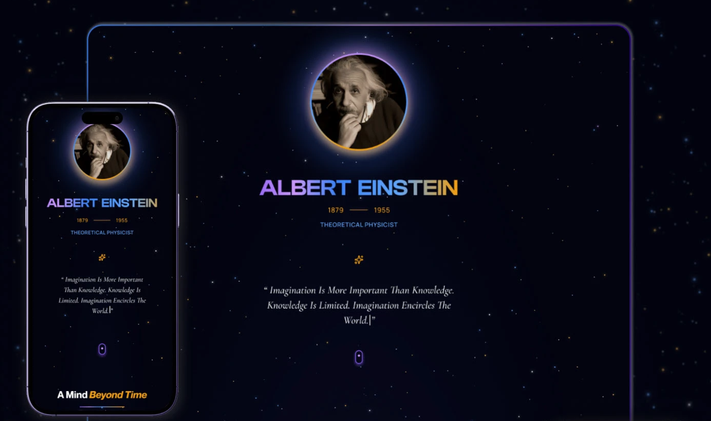

<!--
  - Add Deployment Instructions (add to commands section)
  - Add Testing Instructions (add to commands section)
  - Add live demo link
  - Add CD pipeline
  - Add UI animations (scroll effects, hover states, etc.)
  - Add in Tech Stack the testing frameworks (e.g., Jest, React Testing Library), and deployment platforms (e.g., Vercel, Netlify)
  - Add performance optimizations (lazy loading, code splitting)
  - Add analytics tracking (Google Analytics, etc.)
  - Add SEO meta tags (title, description, keywords) in HTML
  - Clean up code following SOLID principles
  !-->

  <div align="center" id="top">
    

  <h1>Albert Einstein</h1>
  <p>
    "
    "Life is like riding a bicycle. To keep your balance you must keep moving."

  </p>
  
  <p>
    <a href="https://github.com/pedromst2000/Einstein-Tribute-Page/issues/new?labels=bug&template=bug_report.md">Report Bug</a>
    ·
    <a href="https://github.com/pedromst2000/Einstein-Tribute-Page/issues/new?labels=enhancement&template=feature_request.md">Request Feature</a>
  </p>
</div>

## Table of Contents

- [:bulb: About](#bulb-about)
- [:sparkles: UI Preview](#sparkles-ui-preview)
- [:computer: Tech Stack](#computer-tech-stack)
- [:rocket: Getting Started](#rocket-getting-started)
  - [:clipboard: Prerequisites](#clipboard-prerequisites)
  - [:mag: Verification](#mag-verification)
  - [:inbox_tray: Installation Steps](#inbox_tray-installation-steps)
  - [:arrow_forward: Available Commands](#arrow_forward-available-commands)
- [:handshake: Contributing](#handshake-contributing)
  - [Naming Conventions](#naming-conventions)
  - [Contribution Workflow](#contribution-workflow)
  - [CI Pipeline](#ci-pipeline)
- [:page_facing_up: License](#page_facing_up-license)

 <br>

## :bulb: About

A modern, responsive **tribute landing page** dedicated to **Albert Einstein**, one of the greatest minds in human history. This project showcases his life story, achievements, and legacy through an elegant and interactive user interface with stunning animated interactions.

**What you'll discover:**

- 🎓 **Comprehensive Biography** - Explore Einstein's journey from his early years to becoming a revolutionary physicist
- 📅 **Interactive Timeline** - Navigate through key milestones, discoveries, and achievements in Einstein's life with smooth scroll animations
- 💡 **Legacy & Impact** - Learn about his contributions to physics, philosophy, and humanity
- 🎨 **Elegant Design** - Experience a visually engaging tribute with modern aesthetics, animated interactions, and scroll-triggered effects

**Key Features:**

- 📱 Fully responsive design optimized for mobile, tablet, and desktop
- ⚡ Fast, performant single-page application with client-side routing
- ✨ Animated scroll effects and interaction animations powered by Framer Motion
- ♿ Accessibility-focused UI for an inclusive user experience
- 🎯 Three distinct sections: Hero with iconic quote, detailed Biography, and chronological Timeline

<br>

## :sparkles: UI Preview

<div align="center">
  <p>
    <strong>Click the image below to view the full interactive gallery on Behance</strong> 🎨<br>
    <a href="https://www.behance.net/gallery/236041993/Einstein-Tribute-Landing-Page" target="_blank" rel="noopener noreferrer">
      
    </a>
  </p>
  <p>
    <a href="https://www.behance.net/gallery/236041993/Einstein-Tribute-Landing-Page" target="_blank" rel="noopener noreferrer">
      
    </a>
  </p>
</div>

## :computer: Tech Stack

### Core Technologies

- [React 19](https://reactjs.org/) - Frontend UI library
- [TypeScript](https://www.typescriptlang.org/) - Type-safe JavaScript
- [Vite 7](https://vitejs.dev/) - Next-generation build tool

### Styling & UI

- [Tailwind CSS v4](https://tailwindcss.com/) - Utility-first CSS framework
- [Framer Motion](https://www.framer.com/motion/) - React animation library for scroll effects and interactive animations

### Routing

- [React Router v7](https://reactrouter.com/) - Client-side routing

### Code Quality

- [ESLint 9](https://eslint.org/) - JavaScript/TypeScript linter
- [Prettier](https://prettier.io/) - Code formatter
- [Stylelint](https://stylelint.io/) - CSS linter
- [HTML-Validate](https://html-validate.org/) - HTML linter
- [markdownlint](https://github.com/DavidAnson/markdownlint) - Markdown linter
- [yamllint](https://github.com/adrienverge/yamllint) - YAML linter
- TypeScript strict mode - Type checking

### Development Tools

- [Node.js 24.13.0](https://nodejs.org/) - JavaScript runtime
- [npm](https://www.npmjs.com/) - Package manager

 <br>

## :rocket: Getting Started

This project is a **UI-only** Landing Page built with **modern front-end** tooling.
No **backend** services or external **APIs** are required.

Follow these **steps** to set up and `run` the project locally.

### :clipboard: Prerequisites

**Choose one option for Node.js:**

> ⚠️ **Node.js Version Requirement:** `^18.18.0 || ^20.9.0 || >=21.1.0` (minimum v18.18.0)
> The project uses v24.13.0 as the recommended version (specified in `.nvmrc`)

- **Option A (Recommended): nvm** - Installs Node.js automatically via `.nvmrc`
  - **Download** for Windows: [nvm-windows](https://www.nvmnode.com/guide/installation.html)
  - **Download** for macOS/Linux: [nvm-sh](https://www.nvmnode.com/guide/installation-sh.html)
- **Option B: Node.js 24.13.0** - [Download](https://nodejs.org/) (manual install - recommended)
- **Option C: Node.js 20.9.0+** or **18.18.0+** - [Download](https://nodejs.org/) (minimum compatible versions)

**Also required:**

- **npm** - Bundled with Node.js
- **Git** - [Download](https://git-scm.com/)

> 💡 **nvm** reads `.nvmrc` to install/switch Node.js versions automatically.

---

### :mag: Verification

Open the terminal and run the following commands to verify the required tools are installed:

```bash
node -v
npm -v
git --version
```

---

### :inbox_tray: Installation Steps

Follow these steps to get the project running on your local machine.

Open your terminal and run the following commands:

#### **Step 1: Clone the Repository**

```bash
git clone https://github.com/pedromst2000/Einstein-Tribute-Page.git
```

#### **Step 2: Navigate to Project Directory**

```bash
cd Einstein-Tribute-Page
```

> 💡 **Tip:** Can't find the project directory in your terminal? Open the folder directly in your code editor (e.g., VS Code) and use the integrated terminal, or right-click the folder in your file explorer and

select **"Open in Terminal"** / **"Git Bash Here"**.

#### **Step 3: Set Node.js Version (Optional - nvm users only)**

> ⚠️ **Skip this step if you don't have nvm installed.** If you haven't installed nvm, just ensure Node.js 24.13.0 is installed globally and proceed to Step 4. If the `nvm` command is not recognized in your terminal, [install nvm-windows](https://www.nvmnode.com/guide/installation.html) first or skip directly to Step 4.

**If you have nvm installed**, run these commands to install and use Node.js v24.13.0:

```bash
nvm install v24.13.0
```

Then use the version with the appropriate command for your OS:

- **Windows:**

```bash
nvm use $(type .nvmrc)
```

- **macOS/Linux:**

```bash
nvm use
```

> 💡 **Verification:** After this step, verify with `node -v` — it should show `v24.13.0`.

#### **Step 4: Install Dependencies**

```bash
npm install
```

#### **Step 5: Start Development Server**

```bash
npm run dev
```

🎉 Open `http://localhost:5173` in your browser.

> 💡 **Contributing?** Fork the repository first. See [Contributing](#handshake-contributing).

---

### :arrow_forward: Available Commands

| Command                  | Purpose                    | Details                                                  |
| ------------------------ | -------------------------- | -------------------------------------------------------- |
| `npm run dev`            | Start local development    | Vite dev server with HMR at `http://localhost:5173`      |
| `npm run build`          | Build for production       | TypeScript check + optimized build in `dist/`            |
| `npm run lint`           | Lint JavaScript/TypeScript | ESLint validation for TS/JS files                        |
| `npm run lint:fix`       | Auto-fix ESLint issues     | ESLint with `--fix` flag for auto-fixable issues         |
| `npm run lint:html`      | Validate HTML              | Check HTML structure and syntax                          |
| `npm run lint:md`        | Validate Markdown          | Check Markdown formatting and links                      |
| `npm run lint:md:fix`    | Auto-fix Markdown issues   | markdownlint with `--fix` flag                           |
| `npm run lint:css`       | Validate CSS               | Check CSS syntax and best practices                      |
| `npm run lint:css:fix`   | Auto-fix CSS issues        | Stylelint with `--fix` flag                              |
| `npm run lint:yaml`      | Validate YAML              | Check YAML syntax for GitHub Actions workflows           |
| `npm run lint:all`       | Run all linters            | ESLint + HTML + Markdown + CSS + YAML validation         |
| `npm run lint:fix:all`   | Auto-fix all linters       | ESLint + Markdown + CSS fix + Prettier formatting        |
| `npm run prettier`       | Format all files           | Auto-fix formatting (indentation, line endings)          |
| `npm run prettier-check` | Verify formatting          | Check formatting without modifying files (used in CI/CD) |

> 💡 **Quick Formatting Tip:** In VS Code, press **`Alt + Shift + F`** to auto-format the current file!

 <br>

## :handshake: Contributing

Your contributions help keep this tribute to Einstein alive and evolving! Whether you're fixing a typo, improving accessibility, adding historical content, or enhancing the user experience, every contribution matters.

**How to contribute:**

- Found a bug? [Report it](https://github.com/pedromst2000/Einstein-Tribute-Page/issues/new?labels=bug&template=bug_report.md)
- Have an enhancement idea? [Suggest it](https://github.com/pedromst2000/Einstein-Tribute-Page/issues/new?labels=enhancement&template=feature_request.md)
- Ready to code? Follow the workflow below to submit your changes

### Naming Conventions

Follow these **conventions** for branches and commit messages to keep the project organized:

| Type       | Use Case                                          | Branch Example            | Commit Example                            |
| ---------- | ------------------------------------------------- | ------------------------- | ----------------------------------------- |
| `feat`     | Add, adjust, or remove UI features                | `feat/scroll-animations`  | `feat: add scroll animation effects`      |
| `fix`      | Fix UI bugs from previous `feat` commits          | `fix/timeline-overlap`    | `fix: resolve timeline overlap on mobile` |
| `refactor` | Rewrite/restructure code without behavior changes | `refactor/hero-component` | `refactor: simplify hero component logic` |
| `perf`     | Improve performance (special `refactor` type)     | `perf/optimize-fonts`     | `perf: optimize font loading`             |
| `style`    | Code style changes (whitespace, formatting, etc.) | `style/format-imports`    | `style: organize imports and fix spacing` |
| `test`     | Add missing or correct existing tests             | `test/hero-component`     | `test: add hero component tests`          |
| `docs`     | Documentation updates (README, guides, etc.)      | `docs/add-deployment`     | `docs: add deployment instructions`       |
| `build`    | Build system, bundler, dependencies, versions     | `build/upgrade-vite`      | `build: upgrade Vite to v7`               |
| `ops`      | deployment, CI/CD                                 | `ops/add-github-actions`  | `ops: add GitHub Actions CI workflow`     |
| `chore`    | Maintenance tasks, `.gitignore`, initial setup    | `chore/initial-setup`     | `chore: initial project setup`            |
| `revert`   | Revert a previous commit                          | `revert/feat-animations`  | `revert: revert feat scroll-animations`   |

### Contribution Workflow

1. **Get the code:**
   - **External contributors:** Fork the repository, then clone your fork
   - **Collaborators:** Clone the repository directly
2. Create a branch: `git checkout -b <type>/<description>`
3. Make changes and commit: `git commit -m "<type>: <description>"`
4. Push your branch: `git push origin <type>/<description>`
5. Open a **Pull Request**

**PR Requirements:**

- ✅ Title follows [naming convention](#naming-conventions)
- ✅ Description explains changes
- ✅ Screenshots for UI changes
- ✅ All automated CI checks pass (see [CI Pipeline](#ci-pipeline) below)
- ✅ No merge conflicts

### CI Pipeline

Every push and pull request to `master` is automatically validated by [GitHub Actions](https://github.com/pedromst2000/Einstein-Tribute-Page/actions) with intelligent selective runs:

**Execution Modes:**

- **Push to `master`:** All checks run globally (full project scan)
- **Pull Requests & other pushes:** Only checks relevant to changed files run (faster feedback)

Thanks for contributing! 🎉

<br>

## :page_facing_up: License

This project is licensed under the **MIT License**.

See the [LICENSE](LICENSE) file for details.

---

<div align="center">

**Keep moving forward.** 🚀

---

Made with ❤️ and curiosity

[⬆ Back to top](#top)

</div>
